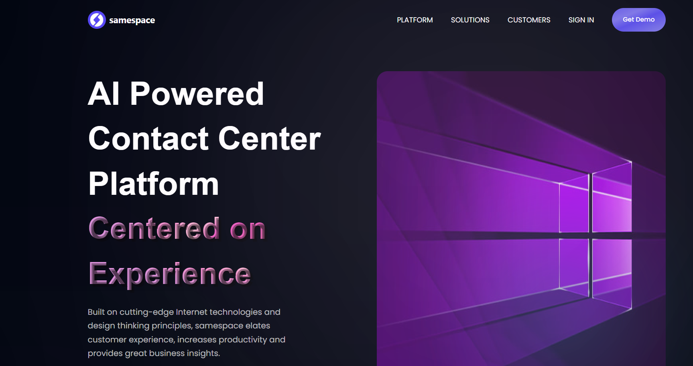
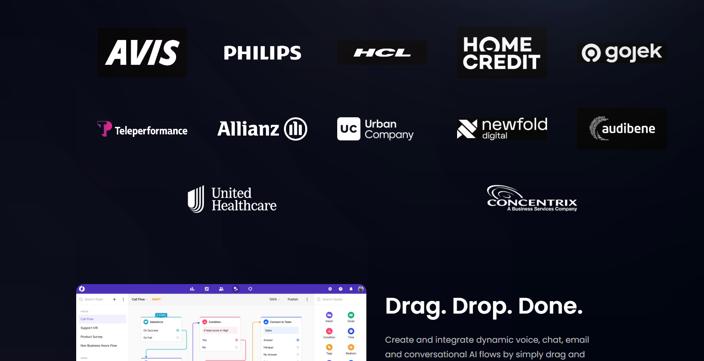
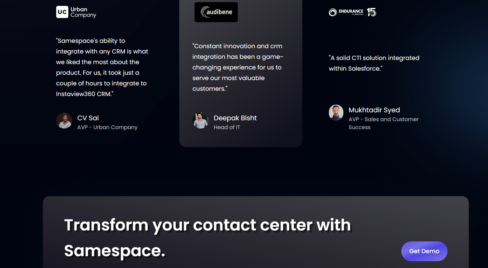
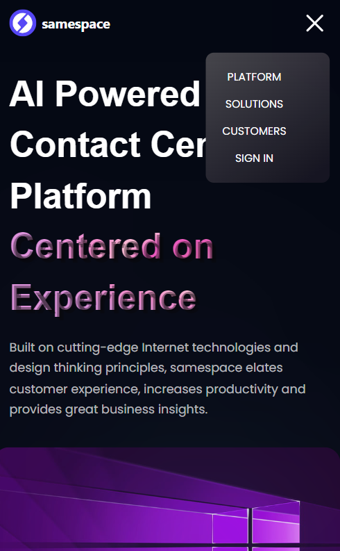
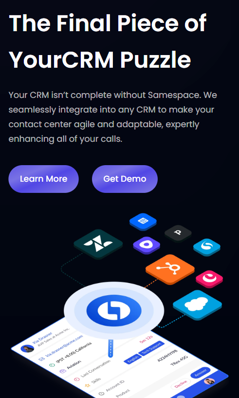
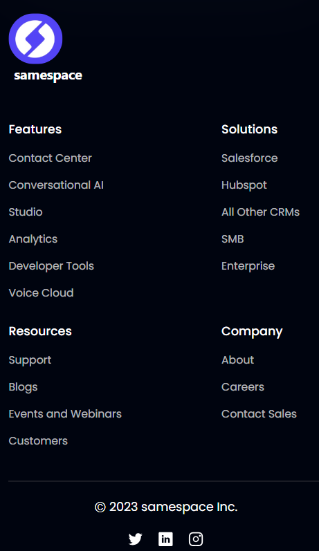

# Samespace Concept UI 
## [Click Here](https://eshan-samespace-react.netlify.app/)
## Description

A modern static and responsive UX/UI landing Page built with React + Vite. 

## Screenshots and GIF


### Desktop







### Mobile








### Demo


## Technologies Used

- 
- 
- 

- 

- 

-  
-  

## Installation

Provide instructions on how to install and run your project locally. You can include any dependencies, environment setup, or configuration steps.

```bash
# Clone the repository
git clone https://github.com/eshan-one/Samespace-Concept-UI-Clone-.git

# Change into the project directory
cd Samespace-Concept-UI-Clone-

# Install dependencies
npm install

# Start the development server
npm start
